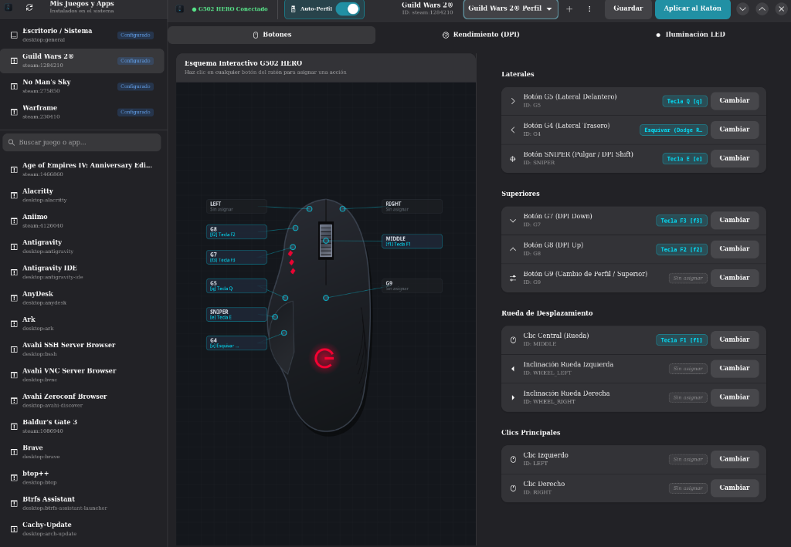
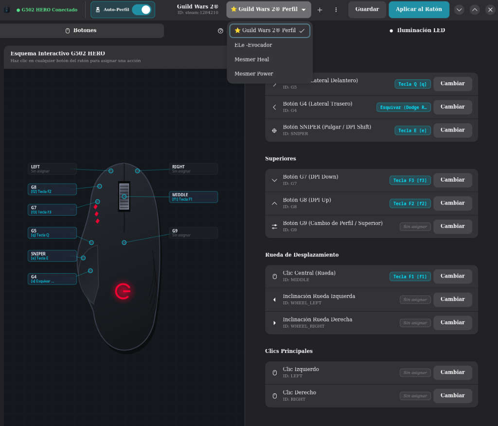
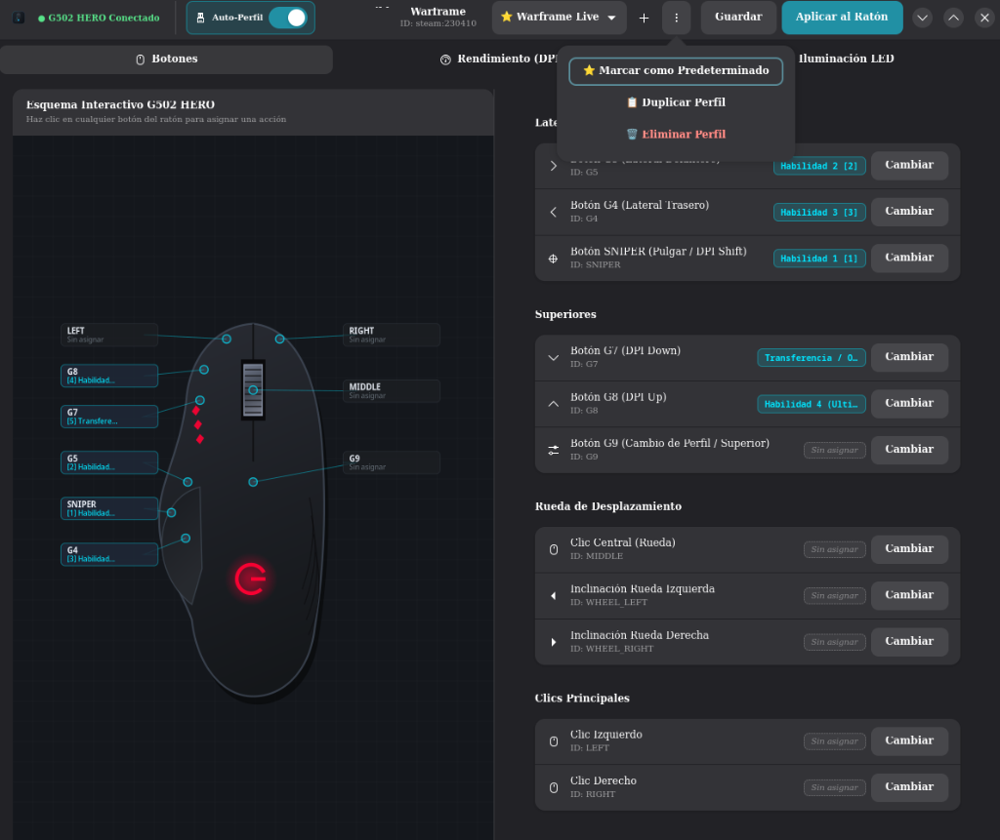
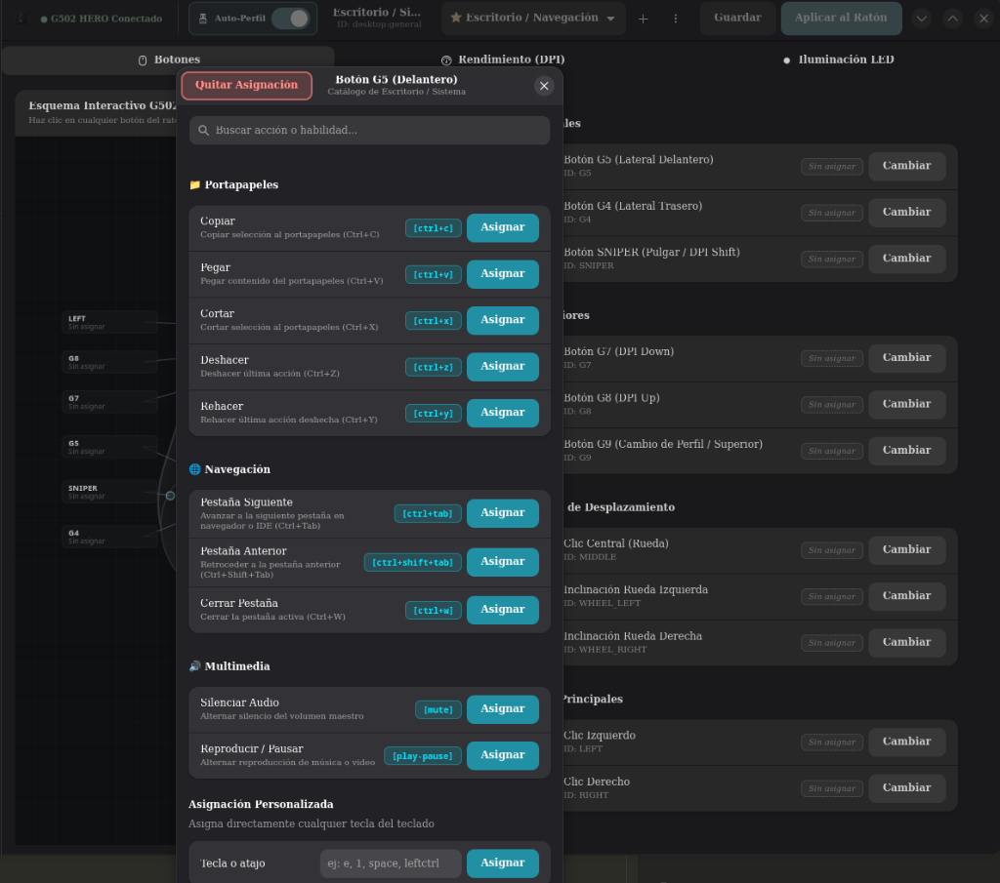

# Logitech G502 HERO Profile Manager (Linux)

[](https://github.com/TheLioN25/g502-profile-manager/actions/workflows/ci.yml)
[](#-ejecución-de-pruebas-unitarias)
[](https://www.python.org/)
[](pyproject.toml)

Administrador avanzado de perfiles y automatización en tiempo real para el ratón **Logitech G502 HERO** en entornos Linux.

Permite configurar visualmente los botones, macros, sensibilidades (DPI) y zonas de iluminación LED del ratón, además de conmutar automáticamente los perfiles de hardware según el videojuego o aplicación activa en el sistema mediante [`ratbagctl`](https://github.com/libratbag/libratbag) (`libratbag`).

<p align="center">
  
</p>

---

## 📸 Galería de Interfaz y Funcionalidades

| Soporte Multi-Perfil por Juego (Guild Wars 2) | Gestión y Perfil Predeterminado (Warframe) |
| :---: | :---: |
|  |  |
| *Múltiples perfiles por juego según tu especialización o personaje.* | *Marca tu perfil favorito como predeterminado con ⭐ para carga reactiva.* |

<p align="center">
  <br/>
  <em><b>Selector de Acciones:</b> Atajos categorizados (Portapapeles, Navegación, Multimedia) y mapeo directo de cualquier tecla del teclado.</em>
</p>

---

## 🌟 Características Principales

* 🎨 **Interfaz Gráfica Moderna (GTK4 + Libadwaita):**
  * Diseño nativo para Linux con soporte de tema oscuro automático.
  * **Barra lateral con gestor de aplicaciones en dos secciones:**
    * **Sección Superior (Configuradas):** Acceso rápido y prioritario a las aplicaciones que ya tienen perfiles configurados (ej. *Escritorio / Sistema*, *Warframe*, *Guild Wars 2*).
    * **Línea divisoria y buscador reactivo:** Barra de búsqueda ubicada estratégicamente sobre las aplicaciones pendientes de configuración.
    * **Sección Inferior (No configuradas):** Catálogo de juegos y aplicaciones instaladas en el sistema, filtrables al vuelo para configurar nuevos títulos.
  * **Interruptor Auto-Perfil (⚡) en la cabecera (HeaderBar):** Permite encender o apagar la auto-detección reactiva directamente desde la interfaz gráfica, manteniendo la GUI 100% fluida en un hilo secundario y mostrando el juego activo y sus DPI en tiempo real en la cabecera.
  * **🔔 Indicador en la Bandeja del Sistema (StatusNotifierItem / System Tray):**
    * Integración nativa con la barra de tareas de KDE Plasma y GNOME mediante D-Bus de sesión puro (sin dependencias obsoletas de GTK 3.0 como `AppIndicator3`).
    * Tooltip dinámico en tiempo real que informa el perfil activo, aplicación detectada, sensibilidad en DPI y estado de auto-detección.
    * Clic interactivo para restaurar y presentar la ventana principal al instante.
  * **Integración nativa con el sistema:** Acceso directo `.desktop` con icono SVG vectorial dedicado de alta resolución, integrado automáticamente con el menú de inicio de KDE Plasma (Kickoff), KRunner y la barra de tareas.
  * **Plano interactivo vectorial del ratón** renderizado en tiempo real con Cairo Canvas: muestra asignaciones de botones, tooltips informativos y sincronización visual con el color LED configurado.
  * Gestión multi-perfil por aplicación: crear, duplicar, renombrar, eliminar y marcar perfiles predeterminados.
  * Selector de acciones con categorías temáticas (*Combate, Armas, Profesión, Movimiento, Productividad*) y asignación rápida de teclas personalizadas.
  * Aplicación instantánea al hardware con ejecución en segundo plano y debouncing para evitar bloqueos de la interfaz.

* 🔄 **Motor de Automatización Reactivo (`engine.py`):**
  * Monitoreo continuo y ligero de procesos activos en segundo plano (vía CLI o interruptor en la GUI).
  * **Descubrimiento unificado de aplicaciones:**
    * 🎮 **Steam:** Detección de juegos instalados y activos mediante lectura de librerías VDF y manifiestos `.acf` (`steam:<appid>`).
    * ⚔️ **Epic Games:** Detección automática en lanzadores Linux (Heroic Games Launcher, Legendary y Lutris).
    * 🖥️ **Escritorio Linux:** Integración con entradas `.desktop` estándar del sistema (XDG).
  * **Restauración Inteligente:** Al cerrar un juego, detener el motor o apagar el interruptor, se restaura automáticamente el perfil de **Escritorio / Sistema** (`desktop:general`).

* ⚙️ **Servicio de Sistema Nativo (`systemd --user`):**
  * Configuración como demonio de usuario nativo con arranque automático en sesión, reinicio por fallos y control unificado desde la terminal o el interruptor de la interfaz gráfica.

* 🛡️ **Aislamiento Total de Perfiles (Modelo G-HUB) y Cumplimiento Anti-Cheat:**
  * Resuelve la persistencia indeseada en la memoria física EEPROM del ratón.
  * Cualquier botón no asignado en un perfil se restablece automáticamente a su función de fábrica (*Back, Forward, DPI Shift, Profile Cycle*), evitando que configuraciones de un juego afecten al escritorio u otros títulos.
  * Política estricta de mapeo de hardware 1:1 sin macros automatizadas o temporizadas, protegiendo las cuentas de juego frente a sanciones por software anti-trampas (EasyAntiCheat, BattlEye, Ricochet, etc.).

* 🧩 **Catálogos y Presets Modulares (`presets/`):**
  * Presets integrados en formato JSON ampliables para juegos como **Warframe** y **Guild Wars 2** (incluyendo mecánicas de profesión F1–F5 y habilidades personalizables), además de atajos de productividad para el escritorio.

* 🧪 **Suite de Pruebas Exhaustiva:**
  * 126 pruebas unitarias automatizadas con cobertura en dominio, persistencia atómica, adaptadores de hardware, lógica de interfaz gráfica, bandeja del sistema, empaquetado de escritorio y servicio systemd.

---

## 🏗️ Arquitectura del Proyecto

El proyecto está diseñado bajo principios de **Domain-Driven Design (DDD)** y **Clean Architecture**, asegurando un desacoplamiento estricto entre la lógica de negocio, los controladores de hardware y la interfaz de usuario:

> 📘 **Documentación Técnica Completa:** Para ver diagramas C4 en detalle (Contexto, Contenedores, Componentes), análisis de capas y registros formales de decisiones de diseño (ADR-001 a ADR-006), consulta [**`docs/ARCHITECTURE.md`**](docs/ARCHITECTURE.md).

```text
g502-profile-manager/
├── docs/                        # Documentación técnica de arquitectura
│   └── ARCHITECTURE.md          # Diagramas C4, Clean Architecture y registros ADR
├── data/                        # Recursos del sistema y accesos directos
│   ├── icons/                   # Icono SVG vectorial (io.github.thelion.G502ProfileManager.svg)
│   ├── io.github.thelion.G502ProfileManager.desktop # Entrada .desktop estándar XDG
│   └── g502-profile-manager.service # Unidad de servicio systemd --user
├── presets/                     # Manifiestos JSON de presets por juego/aplicación
│   ├── desktop_general.json
│   ├── steam_1284210_guildwars2.json
│   └── steam_230410_warframe.json
├── scripts/                     # Scripts de utilidad e instalación en el sistema
│   ├── install-bin.sh           # Instalación de accesos directos 'g502' y 'g502-gui' en PATH
│   ├── uninstall-bin.sh         # Desinstalación limpia de binarios en ~/.local/bin
│   ├── install-desktop.sh       # Instalación de lanzador e icono en el sistema
│   ├── uninstall-desktop.sh     # Desinstalación del lanzador XDG
│   ├── install-service.sh       # Instalación y arranque del servicio systemd --user
│   └── uninstall-service.sh     # Detención y desinstalación del servicio systemd
├── src/
│   ├── domain/                  # Entidades de dominio puro (sin dependencias externas)
│   │   ├── application.py       # Entidad Application y Value Object Action
│   │   ├── button.py            # Definición e invariantes de botones del G502
│   │   ├── dpi.py               # Configuración y validación de rangos de DPI
│   │   └── profile.py           # Agregado Profile y reglas de asignación
│   ├── services/                # Servicios de aplicación y orquestación
│   │   ├── action_catalog.py    # Gestión de catálogos y presets modulares
│   │   └── profile_manager.py   # Casos de uso de gestión y persistencia de perfiles
│   ├── storage/                 # Capa de infraestructura y almacenamiento
│   │   └── profile_repository.py# Repositorio JSON con recarga dinámica y escritura atómica
│   ├── adapters/                # Adaptadores para sistemas externos y hardware
│   │   ├── ratbag_adapter.py    # Comunicación con libratbag/ratbagctl y aislamiento EEPROM
│   │   └── application_discovery_adapter.py # Descubrimiento unificado (Steam + Epic + Desktop)
│   ├── gui/                     # Capa de presentación GTK4 / Libadwaita
│   │   ├── app.py               # Punto de entrada de la aplicación gráfica
│   │   ├── window.py            # Ventana principal y control de eventos
│   │   ├── tray.py              # Indicador en bandeja del sistema (D-Bus StatusNotifierItem)
│   │   ├── dialogs.py           # Diálogos modales (ActionPicker, NewProfile)
│   │   ├── mouse_diagram.py     # Canvas vectorial interactivo en Cairo
│   │   └── style.css            # Estilos Adwaita personalizados
│   ├── engine.py                # Demonio de automatización en tiempo real
│   ├── cli.py                   # Herramienta de línea de comandos
│   ├── steam_discovery.py       # Parser de VDF / ACF de Steam
│   ├── epic_discovery.py        # Descubrimiento de juegos de Epic Games
│   ├── desktop_entries.py       # Parser de archivos .desktop de Linux
│   └── process_discovery.py     # Inspección de procesos del sistema
└── tests/                       # Suite de 126 pruebas unitarias
```

---

## 🧭 Guía Rápida para Revisión Técnica (Code & Architecture Review)

Para facilitar la evaluación de la arquitectura, patrones de diseño y calidad del código, estos son los componentes y rutas clave recomendados:

| Área Técnica | Archivo / Componente | Aspectos Clave a Evaluar |
| :--- | :--- | :--- |
| **Arquitectura Global y C4** | [`docs/ARCHITECTURE.md`](docs/ARCHITECTURE.md) | Diagramas C4 en Mermaid (Contexto, Contenedores, Componentes) y separación Clean Architecture. |
| **Decisiones de Diseño (ADRs)** | [`docs/ARCHITECTURE.md`](docs/ARCHITECTURE.md#5-registros-de-decisiones-de-arquitectura-adr) | 6 registros ADR (Cumplimiento Anti-Cheat 1:1, D-Bus SNI puro, persistencia atómica, systemd, etc.). |
| **Capa de Dominio Puro (DDD)** | [`src/domain/`](src/domain/) | Entidades y Value Objects puros sin librerías externas (`Profile`, `Button`, `Action`, `DpiConfiguration`). |
| **Persistencia Atómica** | [`src/storage/profile_repository.py`](src/storage/profile_repository.py) | Patrón Repositorio con escritura atómica en 2 fases (`NamedTemporaryFile` + `replace`) y sincronización concurrente por `mtime`. |
| **Aislamiento de Hardware** | [`src/adapters/ratbag_adapter.py`](src/adapters/ratbag_adapter.py) | Sanitización de memoria física EEPROM del ratón y reseteo preventivo a valores de fábrica (modelo G-HUB). |
| **Bandeja del Sistema D-Bus** | [`src/gui/tray.py`](src/gui/tray.py) | StatusNotifierItem directo sobre `Gio.DBusConnection` (elimina el conflicto clásico de `AppIndicator3` con GTK4). |
| **Concurrencia en GUI** | [`src/gui/window.py`](src/gui/window.py) | Monitoreo en hilo secundario independiente (`threading.Thread`) y despacho seguro al renderizado GTK4 con `GLib.idle_add`. |
| **Suite de Pruebas Unitarias**| [`tests/`](tests/) | 126 pruebas unitarias automatizadas con mocks puros (ejecutables con `python3 -m unittest discover -s tests`). |
| **Pipeline de CI/CD** | [`.github/workflows/ci.yml`](.github/workflows/ci.yml) | Automatización multi-versión de Python con validación en servidor gráfico headless (`xvfb-run`). |

---

## 📋 Requisitos del Sistema

1. **Linux** con Python 3.10 o superior.
2. **libratbag / ratbagctl:** Servicio de configuración de ratones para Linux.
3. **Bibliotecas de interfaz gráfica:** GTK4, Libadwaita y PyGObject.

### Instalación de dependencias

* **Debian / Ubuntu / Pop!_OS:**
  ```bash
  sudo apt install libratbag-tools ratbagd python3-gi gir1.2-gtk-4.0 gir1.2-adw-1 python3-cairo
  ```

* **Arch Linux / Manjaro:**
  ```bash
  sudo pacman -S libratbag python-gobject gtk4 libadwaita python-cairo
  ```

* **Fedora:**
  ```bash
  sudo dnf install libratbag-ratbagd python3-gobject gtk4 libadwaita python3-cairo
  ```

### Habilitar el servicio del ratón
Asegúrate de que el demonio `ratbagd` esté iniciado y tu G502 sea reconocido:
```bash
sudo systemctl enable --now ratbagd
ratbagctl list
```

---

## 🚀 Guía de Uso

### 1. Interfaz Gráfica (Recomendado)
Para abrir el administrador visual con el plano interactivo del ratón:
```bash
python3 src/gui/app.py
```
* **Organizador de aplicaciones:** Explora las aplicaciones ya configuradas en la sección superior o utiliza el buscador para configurar títulos nuevos desde la sección inferior.
* **Interruptor Auto-Perfil (⚡):** Enciende el switch en la barra superior para activar la supervisión de procesos en segundo plano. Detectará cuando entres o salgas de tus juegos y aplicará o restaurará los perfiles en tiempo real sin congelar la ventana.
* **Personalización Completa:** Ajusta los DPI, el color LED o haz clic en cualquier botón del esquema interactivo para asignarle una acción del catálogo o una tecla personalizada.
* **Aplicar al ratón:** Graba instantáneamente la configuración en la memoria física del ratón.

### 2. Integración en el Menú de Aplicaciones (KDE Plasma / GNOME)
Para registrar la aplicación en el menú de inicio de Linux (Kickoff, KRunner, barra de tareas) con su propio icono SVG:
```bash
# Instalar acceso directo en ~/.local/share/applications/ e icono en ~/.local/share/icons/
./scripts/install-desktop.sh
# (o mediante la CLI: python3 src/cli.py install-desktop)

# Para desinstalar el acceso directo:
./scripts/uninstall-desktop.sh
# (o mediante la CLI: python3 src/cli.py uninstall-desktop)
```

### 3. Servicio de Usuario en Segundo Plano (`systemd --user`)
Para que el motor de auto-detección arranque automáticamente y en silencio cada vez que inicies sesión en tu equipo:
```bash
# Instalar y arrancar el servicio de usuario systemd
./scripts/install-service.sh
# (o mediante la CLI: python3 src/cli.py install-service)

# Consultar el estado del servicio:
python3 src/cli.py service-status

# Inspeccionar logs en vivo con journalctl:
journalctl --user -u g502-profile-manager.service -f

# Detener y desinstalar el servicio:
./scripts/uninstall-service.sh
# (o mediante la CLI: python3 src/cli.py uninstall-service)
```
*(Nota: Si el servicio systemd está activo, la interfaz gráfica lo detectará automáticamente y sincronizará el interruptor de la barra superior).*

### 4. Motor de Automatización en Segundo Plano (Modo Demonio CLI manual)
También puedes ejecutar la auto-detección de forma independiente desde una terminal o script:
```bash
python3 src/engine.py
```
* El motor detectará automáticamente el lanzamiento de juegos compatibles (ej. Warframe, Guild Wars 2) y aplicará su perfil asignado.
* Al salir del juego o detener el motor con `Ctrl+C`, se restablecerá automáticamente el perfil de **Escritorio / Sistema**.

### 5. Interfaz de Línea de Comandos (CLI) y Binarios en PATH
Puedes ejecutar la CLI directamente mediante `python3 src/cli.py` o instalar los accesos directos en tu terminal (`~/.local/bin`):
```bash
# Instalar los comandos 'g502' y 'g502-gui' en tu PATH:
./scripts/install-bin.sh
# (o mediante la CLI: python3 src/cli.py install-bin)

# A partir de ese momento, puedes invocar directamente:
g502 list                       # Listar aplicaciones detectadas
g502 profiles                   # Listar perfiles configurados
g502 export respaldo.json       # Exportar perfiles
g502-gui                        # Abrir la interfaz gráfica
```

### 6. Copia de Seguridad y Portabilidad de Perfiles (`export` / `import`)
Para compartir tus perfiles entre diferentes equipos o respaldar tus configuraciones:
```bash
# Exportar todos los perfiles configurados a un archivo JSON:
g502 export mi_respaldo.json

# Exportar únicamente los perfiles de un juego específico:
g502 export warframe_perfiles.json --app steam:230410

# Importar perfiles desde un archivo (omite duplicados de forma segura):
g502 import mi_respaldo.json

# Importar sobrescribiendo perfiles existentes con el mismo ID:
g502 import mi_respaldo.json --overwrite
```

---

## 🎮 Compatibilidad en Juegos (Steam / Proton / Wayland)

Si juegas títulos de Windows en Linux mediante **Steam Play / Proton**:
* Se recomienda utilizar versiones estables como **Proton 10** o **Proton Experimental**.
* Si ejecutas un juego bajo Wayland (ej. KDE Plasma o GNOME) con versiones personalizadas de Wine/Proton y notas que las teclas compuestas del ratón no se registran en el juego, añade el siguiente parámetro en las **Opciones de lanzamiento** de Steam del juego:
  ```bash
  PROTON_ENABLE_WAYLAND=0 %command%
  ```
  *(O junto con MangoHud: `PROTON_ENABLE_WAYLAND=0 mangohud %command%`)*. Esto garantiza que las señales de teclado del ratón viajen de forma directa y sin interferencias a través de la capa XWayland.

---

## 🧪 Ejecución de Pruebas Unitarias

Para ejecutar la suite completa de 126 pruebas automatizadas:
```bash
python3 -m unittest discover -s tests -v
```
Las pruebas validan invariantes de dominio, persistencia atómica en disco, importación/exportación resiliente, sincronización de hardware mediante mocks y la lógica de la interfaz gráfica sin requerir hardware físico conectado.

---

## 📄 Licencia

Proyecto privado desarrollado para optimización de periféricos Logitech en Linux.
