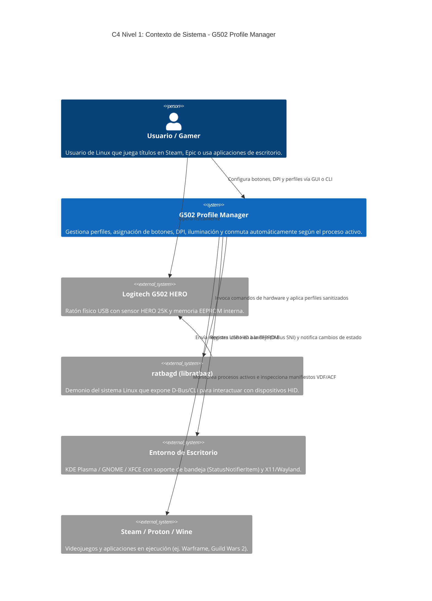
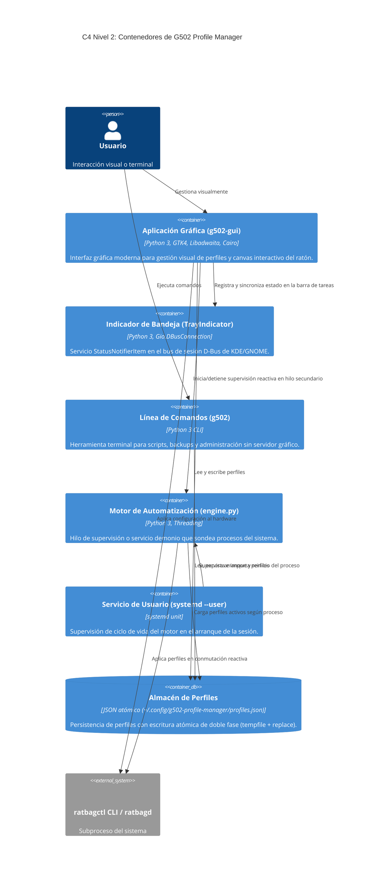

# Arquitectura de Software y Decisiones de Diseño (ADR)
## Logitech G502 HERO Profile Manager para Linux

> **Estado del Documento:** Aprobado / Vigente  
> **Nivel de Audiencia:** Senior / Staff Software Engineer, Desarrolladores de Sistemas Linux, Diseñadores de Infraestructura  
> **Versión de Especificación:** 1.2.0  
> **Repositorio:** [TheLioN25/g502-profile-manager](https://github.com/TheLioN25/g502-profile-manager)

---

## 1. Resumen Ejecutivo y Contexto del Problema

El ratón para videojuegos **Logitech G502 HERO** es uno de los periféricos de alta gama más populares del mercado. Dispone de un sensor óptico HERO 25K, 11 botones físicos programables, memoria física no volátil (EEPROM) y zonas de iluminación RGB programables.

En sistemas operativos privativos (Windows/macOS), la gestión de este dispositivo depende de la suite *Logitech G HUB*, una aplicación cerrada y pesada basada en Electron, con consumo elevado de memoria RAM y telemetría activa. En entornos GNU/Linux, no existe soporte oficial de Logitech. La comunidad de código abierto ofrece [`libratbag`](https://github.com/libratbag/libratbag) y el demonio [`ratbagd`](https://github.com/libratbag/libratbag), que interactúan directamente con los dispositivos HID de Logitech a través del kernel Linux.

Sin embargo, las interfaces existentes (como `piper`) presentan limitaciones críticas para usuarios exigentes:
1. **Falta de reactividad automática:** No conmutan perfiles automáticamente al cambiar de ventana o videojuego activo.
2. **Contaminación de la memoria EEPROM:** Al escribir perfiles directamente en el hardware sin sanitizar las funciones residuales, los botones no asignados heredan funciones de perfiles previos o de fábrica de manera errática.
3. **Ausencia de integración nativa con el escritorio:** No se adaptan al estándar visual de Linux moderno (GNOME Libadwaita / KDE Plasma Breeze) ni proporcionan servicios en segundo plano (`systemd --user`) con indicadores en la bandeja del sistema (*StatusNotifierItem*).

**G502 Profile Manager** resuelve esta problemática construyendo un sistema desacoplado, modular y altamente eficiente, diseñado bajo principios de **Clean Architecture** y **Domain-Driven Design (DDD)**, proporcionando automatización reactiva en tiempo real, interfaz gráfica GTK4/Libadwaita nativa y total seguridad anti-cheat.

---

## 2. Diagramas de Arquitectura C4

Para proporcionar una visión técnica completa a distintos niveles de abstracción, se emplea el modelo C4 (*Context, Containers, Components*).

### 2.1 C4 Nivel 1: Diagrama de Contexto de Sistema

Ilustra la relación entre el usuario, el sistema G502 Profile Manager y los límites de su entorno (servidor gráfico, subsistema del kernel, juegos y demonios del sistema).



---

### 2.2 C4 Nivel 2: Diagrama de Contenedores

Detalla las unidades ejecutables independientes que componen la solución y sus mecanismos de comunicación inter-proceso (IPC).



---

### 2.3 C4 Nivel 3: Diagrama de Componentes

Descompone la arquitectura interna de código (`src/`) mostrando la adhesión a los principios de **Clean Architecture**.

```mermaid
C4Component
    title C4 Nivel 3: Componentes Internos de G502 Profile Manager

    Container_Boundary(domain_b, "Capa de Dominio (Pure Python)")
        Component(profile_ent, "Profile (Agregado)", "Entidad de perfil que encapsula botones, DPI y reglas de negocio.")
        Component(button_vo, "Button & ButtonAction (Value Objects)", "Invariantes de los 11 botones físicos del G502.")
        Component(dpi_vo, "DpiConfiguration (Value Object)", "Validación de rango (100–25,600 DPI) y pasos de sensibilidad.")
        Component(app_ent, "Application (Entidad)", "Identificador unificado (steam:<id>, heroic:<id>, desktop:<id>).")
    End

    Container_Boundary(services_b, "Capa de Aplicación (Casos de Uso)")
        Component(prof_mgr, "ProfileManager", "Orquesta creación, duplicación, cambio, persistencia e import/export de perfiles.")
        Component(action_cat, "ActionCatalogService", "Carga presets modulares (JSON) y acciones por categoría de juego.")
    End

    Container_Boundary(adapters_b, "Capa de Adaptadores e Infraestructura")
        Component(repo_adapter, "JsonProfileRepository", "Implementa IProfileRepository con persistencia atómica y sincronización por mtime.")
        Component(hw_adapter, "RatbagHardwareAdapter", "Encapsula llamadas a ratbagctl y garantiza el aislamiento de EEPROM.")
        Component(disc_adapter, "ApplicationDiscoveryAdapter", "Descubre juegos instalados en Steam (VDF/ACF), Epic (Heroic/Lutris) y XDG .desktop.")
        Component(proc_adapter, "ProcessMonitorAdapter", "Inspecciona procesos del sistema para la conmutación reactiva.")
        Component(tray_adapter, "TrayIndicator", "Expone interfaz StatusNotifierItem pura vía Gio.DBusConnection.")
    End

    Container_Boundary(ui_b, "Capa de Presentación")
        Component(win_ctrl, "MainWindow (GTK4 / Libadwaita)", "Controlador de la ventana principal y gestión de eventos.")
        Component(canvas_view, "G502MouseDiagram (Cairo)", "Renderizado vectorial del chasis del ratón y marcadores de botones.")
    End

    Rel(win_ctrl, prof_mgr, "Invoca operaciones de perfil")
    Rel(win_ctrl, canvas_view, "Actualiza visualización")
    Rel(win_ctrl, tray_adapter, "Sincroniza estado del tooltip y activa ventana")
    Rel(prof_mgr, repo_adapter, "Persiste cambios")
    Rel(prof_mgr, hw_adapter, "Aplica configuración al hardware")
    Rel(prof_mgr, profile_ent, "Manipula agregados")
    Rel(repo_adapter, profile_ent, "Reconstituye entidades")
    Rel(hw_adapter, button_vo, "Lee asignaciones")
    Rel(hw_adapter, dpi_vo, "Lee sensibilidades")
```

---

## 3. Principios de Clean Architecture y Domain-Driven Design (DDD)

La solución aplica rigurosamente la regla de dependencia de Clean Architecture: **las dependencias del código fuente apuntan exclusivamente hacia adentro, en dirección a las políticas de alto nivel (Dominio)**.

```text
               +-------------------------------------------+
               |         Frameworks & Drivers              |
               |  (GTK4, Cairo, D-Bus, systemd, ratbagctl) |
               |   +-----------------------------------+   |
               |   |       Interface Adapters          |   |
               |   | (Repositories, CLI, Discovery)    |   |
               |   |   +---------------------------+   |   |
               |   |   |      Application          |   |   |
               |   |   |   (ProfileManager,        |   |   |
               |   |   |    ActionCatalogService)  |   |   |
               |   |   |   +-------------------+   |   |   |
               |   |   |   |   Domain Model    |   |   |   |
               |   |   |   | (Profile, Button, |   |   |   |
               |   |   |   |  Dpi, Action)     |   |   |   |
               +---+---+---+-------------------+---+---+---+
```

### 3.1 Capa de Dominio (`src/domain/`)
- **Independencia absoluta:** Cero imports de librerías externas o dependencias del sistema operativo. No importa `Gtk`, `subprocess`, `os` ni `json`.
- **Invariantes de negocio protegidos:**
  - `DpiConfiguration`: Garantiza que los DPI estén en el rango `[100, 25600]`, en múltiplos válidos del sensor HERO.
  - `Button`: Define el enum canónico de los 11 botones físicos (`LEFT`, `RIGHT`, `MIDDLE`, `WHEEL_LEFT`, `WHEEL_RIGHT`, `THUMB_BACK`, `THUMB_FORWARD`, `DPI_SHIFT`, `DPI_UP`, `DPI_DOWN`, `PROFILE_CYCLE`).
  - `Profile`: Agregado raíz que asegura la consistencia entre nombre, aplicación asociada, configuración de botones y DPI.

### 3.2 Capa de Aplicación (`src/services/`)
- Contiene los casos de uso del sistema (`ProfileManager`, `ActionCatalogService`).
- Define los contratos de abstracción (*Ports*) mediante `typing.Protocol`, desacoplándose de la infraestructura de almacenamiento.
- Gestiona la orquestación: al activar un perfil, sincroniza el repositorio y el adaptador de hardware sin que ninguno de ellos conozca al otro.

### 3.3 Capa de Adaptadores e Infraestructura (`src/adapters/`, `src/storage/`, `src/gui/`)
- Transforma los datos entre el formato conveniente para el dominio y el formato conveniente para los agentes externos (archivos JSON, subprocesos de terminal, llamadas D-Bus o widgets de GTK4).

---

## 4. Patrones de Diseño Implementados

### 4.1 Patrón Repositorio (*Repository Pattern*) con Escritura Atómica
- **Ubicación:** `src/storage/profile_repository.py` (`JsonProfileRepository`)
- **Problema:** En sistemas de escritorio, cortes de energía o caídas abruptas de la sesión pueden corromper archivos JSON si se escriben directamente con `open(path, "w")`. Además, la CLI y la GUI pueden ejecutarse concurrentemente.
- **Solución:**
  1. **Escritura atómica en dos fases:** El estado serializado se escribe primero en un archivo temporal en el mismo sistema de archivos (`tempfile.NamedTemporaryFile`) y se realiza un `os.replace` atómico garantizado por el sistema de archivos POSIX.
  2. **Detección de concurrencia mediante `mtime`:** El repositorio mantiene en memoria la marca temporal del archivo en disco (`os.path.getmtime`). Si detecta que otra instancia modificó el archivo, recarga dinámicamente antes de escribir para evitar pérdida de datos.

### 4.2 Patrón Adaptador (*Adapter Pattern*) con Aislamiento de EEPROM
- **Ubicación:** `src/adapters/ratbag_adapter.py` (`RatbagHardwareAdapter`)
- **Problema:** La memoria física del ratón G502 HERO retiene los enlaces de botones escritos previamente. Si un perfil de juego no asigna explícitamente el botón `DPI_SHIFT` (botón de francotirador), este conservará la acción del juego anterior en lugar de regresar a su comportamiento normal.
- **Solución:** `RatbagHardwareAdapter` implementa un mapeo de fábrica estricto (`BUTTON_DEFAULT_FACTORY_MAPPINGS`). Todo botón no mapeado explícitamente por el usuario se reprograma a su valor de fábrica antes de finalizar la escritura, reproduciendo fielmente el comportamiento de aislamiento de perfiles de Logitech G HUB.

### 4.3 Patrón Observador y Trabajador en Hilo Secundario (*Worker Thread + Main Loop Marshalling*)
- **Ubicación:** `src/engine.py`, `src/gui/window.py`
- **Problema:** El sondeo de procesos en Linux (`ps`, `/proc`) y las llamadas de hardware a `ratbagctl` toman entre 50 ms y 400 ms. Ejecutar estas operaciones en el hilo principal de GTK congelaría la interfaz de usuario, produciendo caídas de frames y bloqueos visuales.
- **Solución:**
  - El motor de automatización se ejecuta en un `threading.Thread(daemon=True)`.
  - Cuando se detecta un cambio de juego, la actualización visual se despacha hacia el hilo principal de GTK utilizando exclusivamente `GLib.idle_add(callback, *args)`. Esto garantiza la seguridad de hilos (*thread safety*) de acuerdo con las especificaciones de GTK4.

### 4.4 Patrón *StatusNotifierItem* Nativo sobre D-Bus (Bandeja del Sistema)
- **Ubicación:** `src/gui/tray.py` (`TrayIndicator`)
- **Problema:** La biblioteca histórica `AppIndicator3` está ligada a GTK 3.0. En Python, cargar `AppIndicator3` en una aplicación que ya importó GTK 4.0 desencadena una colisión fatal de namespaces de GObject (`Namespace Gtk 3.0 cannot be loaded when 4.0 is active`).
- **Solución:** Se implementó una clase pura basada en `Gio.DBusConnection` que registra un objeto D-Bus con el contrato XML estándar de `org.kde.StatusNotifierItem`. Esto elimina cualquier dependencia de librerías de C obsoletas y ofrece soporte nativo tanto en KDE Plasma como en GNOME (vía la extensión estándar de bandejas).

---

## 5. Registros de Decisiones de Arquitectura (ADR)

---

### ADR-001: Persistencia en Archivo JSON Atómico vs Base de Datos Relacional (SQLite)

* **Estado:** Aceptado
* **Contexto:**  
  El sistema necesita almacenar la lista de perfiles, mapeos de botones, configuraciones de DPI y colores LED. Los perfiles deben persistir entre reinicios del sistema y sesiones del usuario.
* **Alternativas evaluadas:**
  1. *SQLite:* Potente, transaccional, estándar para datos estructurados.
  2. *Archivo JSON atómico:* Formato plano en `~/.config/g502-profile-manager/profiles.json`.
* **Decisión:**  
  Se seleccionó **JSON atómico** con reemplazo seguro de archivos (`tempfile.NamedTemporaryFile` + `os.replace`).
* **Justificación:**  
  - El volumen de datos es pequeño (típicamente entre 1 y 50 perfiles, < 100 KB).
  - Los usuarios de Linux esperan poder inspeccionar, editar manualmente o realizar control de versiones (`git`) de sus configuraciones en formato de texto plano legible.
  - Elimina dependencias de motores de bases de datos y la complejidad de migraciones de esquemas SQL.
* **Consecuencias:**  
  - *Positivas:* Máxima legibilidad, respaldos triviales, rendimiento instantáneo en memoria.
  - *Negativas:* No es adecuado para millones de registros (no relevante para este caso de uso).

---

### ADR-002: Concurrencia en GUI mediante Hilo Secundario y `GLib.idle_add` vs AsyncIO

* **Estado:** Aceptado
* **Contexto:**  
  La interfaz gráfica debe mantener una tasa de refresco fluida (60+ FPS) mientras el motor de auto-detección inspecciona periódicamente los procesos del sistema y escribe configuraciones al hardware vía `ratbagctl` (llamadas bloqueantes de E/S).
* **Alternativas evaluadas:**
  1. *Python `asyncio`:* Requiere integrar el bucle de eventos de asyncio con el de GLib (`gasyncio` o polling del selector), lo cual es frágil y propenso a inconsistencias entre versiones de PyGObject.
  2. *Worker Thread (`threading.Thread`) + `GLib.idle_add`:* Modelo multihilo estándar de GNOME/GTK.
* **Decisión:**  
  Se implementó **`threading.Thread(daemon=True)`** con despacho de eventos a través de **`GLib.idle_add`**.
* **Justificación:**  
  - Las operaciones de hardware de `ratbagctl` son subprocesos síncronos del sistema operativo (`subprocess.run`). No existen APIs asíncronas nativas en `libratbag`.
  - `GLib.idle_add` es la forma idiomática y robusta de comunicar hilos secundarios con el hilo de renderizado de GTK4, garantizando cero bloqueos y total compatibilidad.
* **Consecuencias:**  
  - *Positivas:* Arquitectura simple, robusta, sin librerías externas ni hacks en el bucle de eventos.
  - *Negativas:* Requiere disciplina estricta de no tocar widgets de GTK desde el hilo secundario.

---

### ADR-003: Demonio en Segundo Plano mediante `systemd --user`

* **Estado:** Aceptado
* **Contexto:**  
  Los usuarios desean que el ratón cambie de perfil automáticamente al abrir sus juegos sin necesidad de tener la ventana gráfica abierta constantemente o recordar abrir una terminal.
* **Alternativas evaluadas:**
  1. *Servicio global del sistema (`systemd /etc/systemd/system/`):* Requiere privilegios de root (`sudo`), no tiene acceso al contexto del usuario ni al bus de sesión D-Bus de X11/Wayland.
  2. *Autostart XDG (`~/.config/autostart/*.desktop`):* Solo lanza el proceso al iniciar la sesión de escritorio, pero no proporciona supervisión de fallos, reinicio automático ni control de logs centralizado.
  3. *Unidad de usuario systemd (`systemd --user`):* Servicio nativo supervisado por el gestor de servicios del usuario (`~/.config/systemd/user/`).
* **Decisión:**  
  Se seleccionó **`systemd --user`** con la unidad `g502-profile-manager.service`.
* **Justificación:**  
  - Cero privilegios de superusuario (`sudo`) requeridos para la instalación o ejecución diaria.
  - Proporciona reinicio automático en caso de fallo (`Restart=on-failure`, `RestartSec=3s`).
  - Integración nativa con `journalctl --user` para inspección de registros.
  - La GUI y la CLI pueden consultar y conmutar el estado del servicio mediante comandos estándar `systemctl --user`.
* **Consecuencias:**  
  - *Positivas:* Robustez de nivel de producción en cualquier distribución Linux basada en systemd.
  - *Negativas:* Requiere que la distribución use systemd (estándar en Fedora, Arch, Ubuntu, Debian, Pop!_OS, etc.).

---

### ADR-004: Integración de System Tray vía D-Bus SNI Nativo vs `AppIndicator3`

* **Estado:** Aceptado
* **Contexto:**  
  Se requería un indicador visual en la bandeja del sistema (KDE Plasma y GNOME) que mostrara el perfil activo, los DPI actuales y permitiera presentar la ventana principal o conmutar la auto-detección.
* **Alternativas evaluadas:**
  1. *`libappindicator3` / `AppIndicator3`:* La librería tradicional para bandejas en Linux.
  2. *Implementación directa D-Bus sobre `org.kde.StatusNotifierItem` con `Gio.DBusConnection`:* Conexión directa al bus de sesión de GLib.
* **Decisión:**  
  Se seleccionó la **implementación directa sobre el protocolo StatusNotifierItem vía `Gio.DBusConnection`**.
* **Justificación:**  
  - `AppIndicator3` depende estrictamente de GTK 3.0. En aplicaciones GTK 4.0 modernas, intentar importar `gi.repository.AppIndicator3` produce una excepción crítica por conflicto de namespaces en tiempo de ejecución.
  - El protocolo *StatusNotifierItem* (creado por KDE y adoptado universalmente en Linux) es una especificación abierta sobre D-Bus.
  - `Gio` ya forma parte del runtime de GTK4, por lo que no se añade ninguna dependencia externa al sistema.
* **Consecuencias:**  
  - *Positivas:* Cero conflictos de librerías, arranque instantáneo, compatible de forma nativa con KDE Plasma y GNOME (con extensión AppIndicator estándar). Degradación elegante y silenciosa en entornos headless.
  - *Negativas:* Requiere mantener la serialización XML de introspección D-Bus del protocolo SNI.

---

### ADR-005: Política Estricta de Mapeo 1:1 y Cumplimiento Anti-Cheat (Rechazo de Macros Automatizadas)

* **Estado:** Aceptado
* **Contexto:**  
  Muchos softwares de periféricos de terceros permiten la creación de macros con retardos de tiempo (*delays*), secuencias de múltiples pulsaciones automáticas (*multi-key loops*) o automatización de combinaciones complejas.  
  Sin embargo, los sistemas anti-trampas de videojuegos multijugador competitivos modernos (como **Easy Anti-Cheat**, **BattlEye**, **Ricochet**, **Valve Anti-Cheat** y las políticas de conducta de juegos como *Warframe* y *Guild Wars 2*) monitorean las entradas de periféricos. Los patrones de macros con temporizaciones artificiales o disparos automatizados ("1 pulsación física = múltiples acciones automáticas") son motivo de **suspensión permanente de cuentas de usuario**.
* **Decisión:**  
  Se estableció una regla arquitectónica inquebrantable: **G502 Profile Manager implementa estricta y exclusivamente el principio de Mapeo de Hardware 1:1 ("1 pulsación física = 1 acción de hardware o combinación de teclas simultánea")**. Queda formalmente prohibida la inclusión de motores de ejecución de macros temporizadas o automatizadas en segundo plano.
* **Justificación:**  
  - **Protección absoluta de las cuentas de los usuarios:** El software actúa como un orquestador legítimo de configuración de hardware, no como un inyector de inputs sintéticos ni un bot.
  - Las acciones mapeadas son enviadas directamente a los registros de memoria del ratón (`libratbag`), de modo que el kernel de Linux y los videojuegos las reciben como eventos de hardware legítimos emitidos por el microcontrolador del periférico.
* **Consecuencias:**  
  - *Positivas:* Total tranquilidad y seguridad para los usuarios en cualquier título competitivo en línea; simplicidad conceptual del modelo de dominio de acciones.
  - *Negativas:* Aquellos usuarios que busquen crear scripts de automatización ("autofire", "bhop scripts") deberán utilizar herramientas dedicadas de accesibilidad externa bajo su propia responsabilidad.

---

### ADR-006: Filosofía de Configuración Centrada en la Creación Intencional del Usuario

* **Estado:** Aceptado
* **Contexto:**  
  Al plantear la gestión de perfiles para juegos, surgió la posibilidad de incluir funciones masivas de importación/exportación de perfiles comunitarios en la interfaz gráfica, o compartir automáticamente repositorios públicos de perfiles.
* **Decisión:**  
  Se decidió que la **interfaz gráfica esté enfocada puramente en la creación intencional, exploración y personalización por parte del propio usuario**. Las funciones de exportación e importación se encapsularon exclusivamente en la interfaz de línea de comandos (`g502 export` y `g502 import`) para copias de seguridad personales y portabilidad entre equipos de un mismo usuario.
* **Justificación:**  
  - Cada jugador posee hábitos musculares, mapeos de teclado en el juego y sensibilidades de DPI completamente distintas (ej. agarre tipo *palm*, *claw* o *fingertip*). Un perfil importado de otro usuario casi nunca coincide con la configuración de teclas interna del juego en la máquina local.
  - Incentiva una experiencia de usuario limpia y libre de interfaces complejas o sobrecargadas en la GUI.
  - Mantiene las capacidades de portabilidad técnica accesibles para usuarios avanzados vía CLI.
* **Consecuencias:**  
  - *Positivas:* Interfaz gráfica intuitiva, limpia y centrada en el ratón del usuario; menos superficie de soporte por desconfiguraciones causadas por perfiles externos incompatibles.
  - *Negativas:* Quienes deseen compartir perfiles con amigos deben enviar el archivo JSON y usar el comando terminal `g502 import <archivo.json>`.

---

## 6. Estrategia de Calidad, Pruebas y CI/CD

La robustez del proyecto se valida mediante una estrategia de pruebas exhaustiva que permite verificar el 100% de los casos de uso sin requerir hardware físico conectado:

```text
       +---------------------------------------------+
       |   Integración Continua (GitHub Actions)     |
       |  Matriz: Ubuntu 24.04 (Python 3.10, 11, 12) |
       |  Display Headless: Xvfb (Virtual Framebuf)  |
       +---------------------------------------------+
                             |
       +---------------------------------------------+
       |             117 Pruebas Unitarias           |
       |  - Dominio puro (invariantes, validaciones) |
       |  - Repositorio atómico y persistencia       |
       |  - Aislamiento de hardware (Mocks ratbag)   |
       |  - Descubrimiento (Steam VDF, Epic, XDG)    |
       |  - Controladores GUI y canvas Cairo         |
       |  - Notificador de bandeja D-Bus (SNI)       |
       +---------------------------------------------+
```

1. **Aislamiento Total de Hardware:**
   - Todas las llamadas a `ratbagctl` se mockean a nivel de subproceso o protocolo, permitiendo verificar que los comandos enviados al ratón sean idénticos a las especificaciones sin alterar el dispositivo de desarrollo.
2. **Entornos de Ejecución Virtuales (Headless Testing):**
   - Las pruebas de GTK4 y Libadwaita se ejecutan en CI sin servidor gráfico físico utilizando `xvfb-run` (*X Virtual Framebuffer*), garantizando que los widgets, diálogos y el renderizado Cairo Canvas funcionen sin errores de renderizado.
3. **Pipeline de Integración Continua (CI):**
   - Configurado en `.github/workflows/ci.yml`, ejecuta la suite completa en cada *push* y *pull request*, verificando la sintaxis, tipos y pruebas en las versiones activas de Python (3.10 a 3.12).
